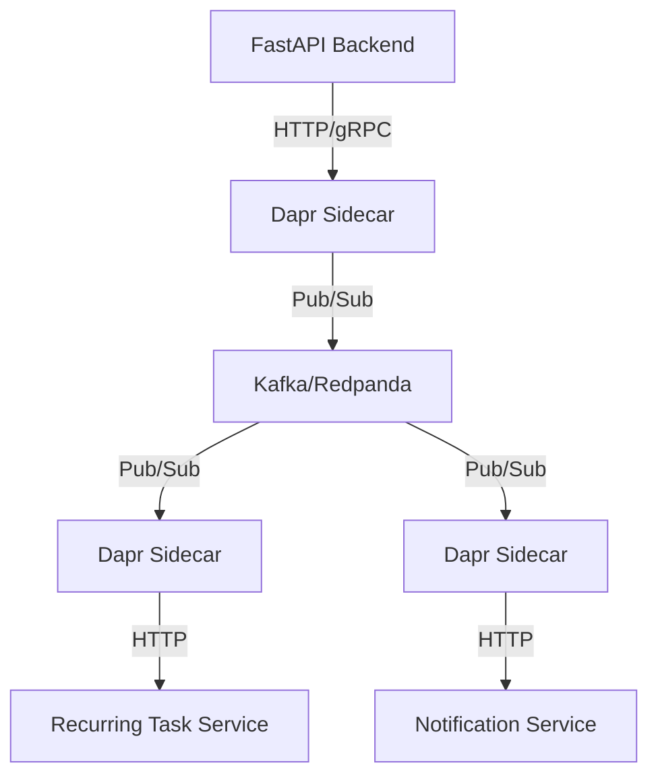

# Advanced Cloud Native Features Specification

## 1. Overview
This document defines the architecture for the "Advanced Cloud Deployment" phase (Phase V).
The goal is to decouple the monolithic backend into an **Event-Driven Microservices** architecture using **Dapr** and **Kafka**.

## 2. Architecture

## 3. Components

### 3.1 Recurring Task Scheduler
- **Function**: Scans database for tasks with `recurrence_pattern` where `next_due_date` <= NOW.
- **Action**:
    1. Clone the task.
    2. Set new `due_date` based on pattern.
    3. Publish `TaskCreated` event.
- **Implementation**: Python script running as a separate container/process.

### 3.2 Event-Driven Updates
- **Producer**: FastAPI Backend.
- **Events**:
    - `task.created`
    - `task.completed`
    - `task.deleted`
- **Consumer**: Analytics Service or Notification Service.

### 3.3 Dapr Integration
- **State Store**: Redis (for extensive caching).
- **Pub/Sub**: Apache Kafka (or Redpanda).
- **Secrets**: Kubernetes Secrets (via Dapr).

## 4. Implementation Steps

### 4.1 Dependencies
- `dapr-client`: For Python SDK.
- `aiokafka`: For direct Kafka access if needed (optional).

### 4.2 Configuration
- `dapr/components/pubsub.yaml`: Defines Kafka component.
- `dapr/config.yaml`: Dapr configuration.

### 4.3 Code Changes
- **Backend**: Inject `DaprClient` to publish events on CRUD operations.
- **Scheduler**: Create `app/services/scheduler.py`.
